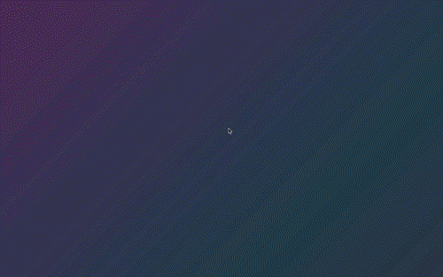

# ClimaStatus
The IoT weather station dashboard. 
By [Dan Beerman](https://www.danbeerman.com)

---


ClimaStatus is a Personal Weather Station registered through Weather Underground. The app is hosted using a continuous deployment strategy with Netlify. 
- Presentation Video: [g70 Capstone Showcase](https://youtu.be/OQbGKI5RDhY)
- View the app: [Live Dashboard App](http://climastatus.netlify.com/)
- View the WU Station:[The Eiber Station](https://www.wunderground.com/personal-weather-station/dashboard?ID=KCODENVE579)

### Check It:



### Technologies: 

  * Raspberry Pi Model 3 B
    - Sense HAT Sensor (formerly Astro Pi)
    - Raspian Stretch Distro
    - Python
    
  * Amazon Web Services
    - Elastic Cloud Compute (EC2)
    - Node + Express js
    - Mongo DB Atlas Cluster
    
  * ClimaStatus Dashboard
    - Netlify deployment strategy
    - Chart.js
    - React
    
### Installation:

You'll have to build your own sensor and server for that data - but this dashboard will run and keep you updated on my temperature/pressure/humidity

```
git clone [this repo]
cd [this repo's folder]

npm install
npm start
``` 

#### Reference Materials: 

- [Raspberry Pi](https://www.raspberrypi.org/)
- [Astero Pi](https://astro-pi.org/)
- [ClimaStatus API](https://github.com/lebeerman/ClimaStatus)
- [Register a Personal Weather Station](https://www.wunderground.com/personal-weather-station/)
- [Icons](https://www.flaticon.com/)
- [Coding the sensors: John Wargo](https://makezine.com/projects/raspberry-pi-weather-station-mount)

---
#### License

MIT

Permission is hereby granted, free of charge, to any person obtaining a copy of this software and associated documentation files (the "Software"), to deal in the Software without restriction, including without limitation the rights to use, copy, modify, merge, publish, distribute, sublicense, and/or sell copies of the Software, and to permit persons to whom the Software is furnished to do so, subject to the following conditions:

The above copyright notice and this permission notice shall be included in all copies or substantial portions of the Software.

THE SOFTWARE IS PROVIDED "AS IS", WITHOUT WARRANTY OF ANY KIND, EXPRESS OR IMPLIED, INCLUDING BUT NOT LIMITED TO THE WARRANTIES OF MERCHANTABILITY, FITNESS FOR A PARTICULAR PURPOSE AND NONINFRINGEMENT. IN NO EVENT SHALL THE AUTHORS OR COPYRIGHT HOLDERS BE LIABLE FOR ANY CLAIM, DAMAGES OR OTHER LIABILITY, WHETHER IN AN ACTION OF CONTRACT, TORT OR OTHERWISE, ARISING FROM, OUT OF OR IN CONNECTION WITH THE SOFTWARE OR THE USE OR OTHER DEALINGS IN THE SOFTWARE.


